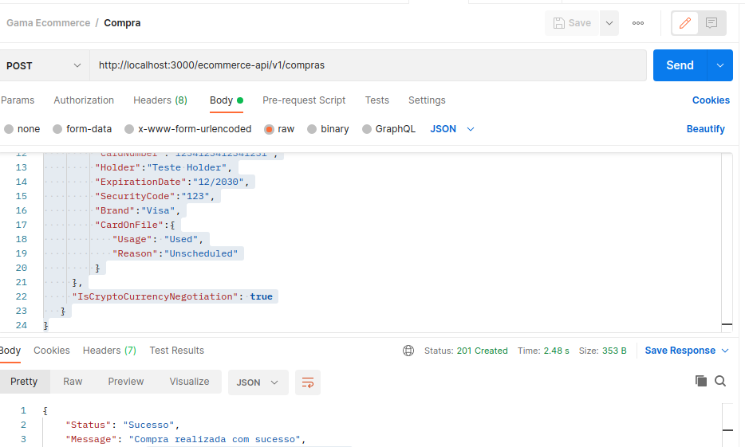
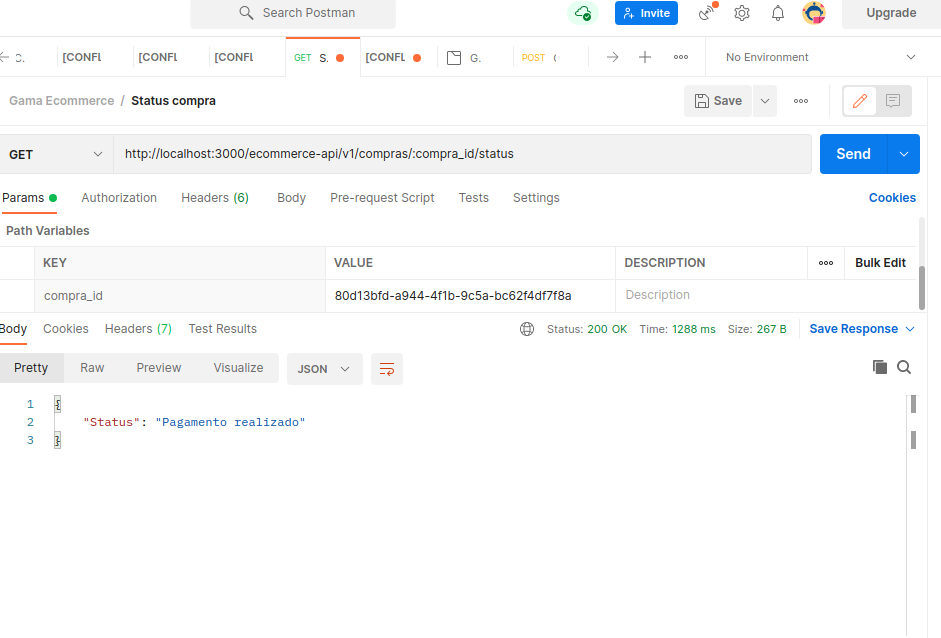

# Consuming Cielo API
The project consist in the use of express generator to create the API and the use of node-fetch to consuming the cielo API to make request in a ecommerce web site backend to make purchases and purchase status inquiries.


## backend dependecies:
- cookie-parser: ~1.4.4,
- debug: ~2.6.9,
- express: ~4.16.1,
- http-errors: ~1.6.3,
- morgan: ~1.9.1,
- pug: 2.0.0-beta11


## The API

You have to use the postman to send the request to the API:

1) The post method (purchasing):

On the request body, put: 

```
{
   "MerchantOrderId":"2014111703",
   "Customer":{
      "Name":"Comprador crédito simples"
   },
   "Payment":{
     "Type":"CreditCard",
     "Amount":15700,
     "Installments":1,
     "SoftDescriptor":"123456789ABCD",
     "CreditCard":{
         "CardNumber":"1234123412341231",
         "Holder":"Teste Holder",
         "ExpirationDate":"12/2030",
         "SecurityCode":"123",
         "Brand":"Visa",
         "CardOnFile":{
            "Usage": "Used",
            "Reason":"Unscheduled"
         }
     },
     "IsCryptoCurrencyNegotiation": true
   }
}
```
Then, send the post request...


2) The get method (purchase status):
You need to put the 'Compra_id' in the status request at the value of compra_id on the url.



## How to start the project 

You need to install all the dependencies into the project folder with the comand below:
To install with NPM: `npm i`

Once the dependencies installed, you can start all services:

To start the server:  ` DEBUG=myapp:* npm start `

Then, It's just use the postman to send de request.